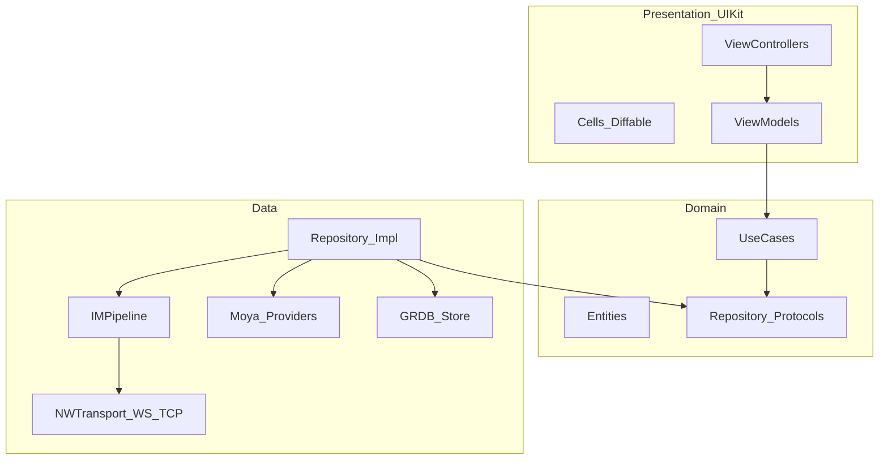

# GO-IM iOS 客户端技术文档

> 文档目标：指导后续用 Tuist 落地一个与现有后端协议对齐的 iOS IM 客户端。  
> 工程位置默认：本仓库 [`ios/`](ios/)（与 `web/` 并列）。  
> 一期 MVP（P0）：登录、会话、**单聊 + 群聊 + 好友 + 文件（上传/收发展示）+ 搜索**、本地消息库、已读/未读、WS/TCP 双通道；撤回/编辑/转发/Typing/APNs 为后续阶段。

---

## 1. 目标与约束

| 项 | 约定 |
|----|------|
| 系统 | iOS 16.0+ |
| 语言 | **Swift 6.4**（开启 Swift 6 语言模式 / 严格并发） |
| UI | **UIKit 为主**；能用 UIKit 不用 SwiftUI（无 SwiftUI 页面/导航） |
| 架构 | Clean Architecture：Domain / Data / Presentation |
| 消息处理 | **Netty 风格 Pipeline**（可插拔 Handler 链） |
| 依赖管理 | Tuist + SPM |
| HTTP | **Moya + Codable**（底层 Alamofire） |
| 长连接 | **WS + TCP** 双通道；优先 **Network.framework**（`NWConnection` / `NWProtocolWebSocket`） |
| 图片 | **Kingfisher** |
| 本地库 | SQLite（**GRDB.swift**） |
| Protobuf | SwiftProtobuf（共享 [`api/proto/message.proto`](api/proto/message.proto)） |
| 后端契约 | [`docs/07-api-reference.md`](docs/07-api-reference.md) |

**非目标（一期不做）**：推送 APNs、E2EE、多账号并行、音视频通话、SwiftUI 混用。

---

## 2. 与后端对齐要点

### 2.1 认证与双通道连接

```mermaid
sequenceDiagram
  participant App
  participant HTTP as Gateway_HTTP
  participant Link as Gateway_WS_or_TCP

  App->>HTTP: POST /login or /register form
  HTTP-->>App: uid, username, token
  alt WebSocket
    App->>Link: NWConnection + NWProtocolWebSocket /ws?token=JWT
  else TCP_gnet
    App->>Link: NWConnection TCP :8081
    App->>Link: LenPrefix_frame CmdLogin_JWT
  end
  Note over App,Link: Payload = protobuf Message
  App->>Link: CmdOffline / CmdChat / CmdHistory ...
  Link-->>App: CmdAck / CmdChat / CmdKick ...
```

- 登录：`POST /login`，`application/x-www-form-urlencoded`（Moya 自定义 encoding）。
- **WS**：`ws(s)://{host}/ws?token={jwt}`，帧体 = Protobuf binary。
- **TCP（gnet）**：`{host}:8081`，帧格式 = **`[4-byte BE uint32 length][protobuf]`**；**首包必须** `CmdLogin` + JWT（见架构说明）。
- `msg.From` 服务端覆盖；客户端填 `to/chat_type/msg_type/content/seq/need_ack`。
- `CmdKick=7`：清会话并回登录页。
- 心跳：统一走应用层 `CmdHeartbeat=6`（`ConnectionRepositoryImpl` 定时发送；连续无响应则拆链重连）。WS 传输层仍可开启 `autoReplyPing`，但不替代应用层心跳。

### 2.2 核心命令字（一期必接，含群）

| Cmd | 值 | 用途 |
|-----|----|------|
| Chat | 1 | 收发消息（`chat_type=1` 单聊 / `=2` 群聊，`to`=peer 或 `g_*`） |
| Ack | 2 | 服务端处理确认（非对端送达） |
| Login / LoginResp | 3 / 4 | TCP 首包鉴权 |
| Offline | 5 | 拉离线 |
| Heartbeat | 6 | 心跳 |
| Kick | 7 | 被踢 |
| History | 8 | 历史分页（群会话同样用 peer=`group_id`） |
| ReadReceipt | 9 | 已读 |
| UnreadCount | 10 | 未读 |
| Search | 11 | 全文搜索（`content` JSON；多条结果 + 完成信号） |
| GroupCreate | 12 | 创建群（`content` JSON name） |
| GroupJoin | 13 | 加入群（`to`=group_id） |
| GroupLeave | 14 | 退群 |
| GroupInfo | 15 | 群资料 + 成员 |
| GroupList | 16 | 我的群列表 |
| File | 17 | 文件/图片消息（走完整聊天管线；`content` 为上传元数据 JSON） |
| GroupInviteMember | 18 | 邀请成员（群主） |
| FriendRequest | 20 | 发起/收到好友请求 |
| FriendResponse | 21 | 接受/拒绝好友请求 |

P1：Recall(19) / Typing(22) / Forward(23) / Edit(24)。

### 2.2.1 群聊协议要点

- 发群消息：`CmdChat` + `chat_type=ChatTypeGroup(2)` + `to=g_{id}`；服务端扇出，客户端按 `conversation_id=group:{gid}` 落库。
- 管理能力双通道：**HTTP**（`/group/create|join|leave|members|list`）与 **WS/TCP Cmd** 均可；客户端 Data 层统一 `GroupRepository`，优先长连接 Cmd，失败可降级 HTTP（Moya）。
- 群通知：成员加入/离开等系统消息走现有 `Message`/`content` 约定，Pipeline 内 `GroupCmdHandler` 解析后更新 `groups` / `group_members` 表并刷新会话标题。
- 未读：群会话与单聊共用 `UnreadCount` / 本地 `conversations.unread_count`；已读回执 `to` 填 group_id。

### 2.2.2 好友协议要点

- `CmdFriendRequest` / `CmdFriendResponse`（20/21）实时通知；HTTP `/friend/*`（与 Web 对齐）做列表、发起、处理的 CRUD 降级与冷启动同步。
- 本地表 `friends` / `friend_requests`；通过好友后可从通讯录进入单聊会话。
- Pipeline：`FriendNotifyHandler` 更新本地关系并驱动 UI 角标。

### 2.2.3 文件协议要点

- `POST /upload`（multipart：uid/token/file）→ 得 `file_id` / mime / 尺寸 / 缩略图信息。
- 发送：`CmdFile`(17) 或 `CmdChat` + `msg_type` 2–5，`content` = 上传返回 JSON（可加附言 text）；收端落库后用 Kingfisher 加载 `/file?id=&thumb=1`（带 token）。
- 下载鉴权：URL 拼 `uid`+`token`；Kingfisher 自定义 `ImageDataProvider` / 请求修饰器注入查询参数。

### 2.2.4 搜索协议要点

- 长连接：`CmdSearch`(11) + `content` JSON（`q`/`peer`/`chat_type`/`limit`/`cursor`）；服务端推多条命中 + 完成信号。
- HTTP：`GET /search?...`（Moya）便于独立搜索页与分页。
- 结果可跳转对应会话并定位 `server_msg_id`；P0 以服务端搜索为主，本地 FTS 不做。

### 2.3 Message 字段

与 [`message.proto`](api/proto/message.proto) 一致。生成脚本：`ios/Scripts/generate-proto.sh`。

### 2.4 消息状态机（客户端）

```
sending → sent(Ack) → read(ReadReceipt)
         ↘ failed（超时/断线，clientSeq 幂等重试）
```

`CmdAck` ≠ 对端已读。

---

## 3. Clean Architecture 分层



### 3.1 Domain（纯 Swift，无 UIKit / 网络）

- Entities：`User`, `Message`, `Conversation`, `Group`, `GroupMember`, `Friend`, `FriendRequest`, `FileMeta`, `SearchHit`, `MessageStatus`, `TransportKind`
- Ports：`AuthRepository`, `MessageRepository`, `ConversationRepository`, `GroupRepository`, `FriendRepository`, `FileRepository`, `SearchRepository`, `ConnectionRepository`
- UseCases：Login/Logout、ObserveConnection、SendText、**SendFileMessage**、ObserveMessages、LoadHistory、MarkRead、SyncOffline、SwitchTransport、群相关 UseCase、**SendFriendRequest / RespondFriendRequest / ObserveFriends**、**UploadFile**、**SearchMessages**

### 3.2 Data

| 组件 | 职责 |
|------|------|
| `GOIMAPI` (Moya `TargetType`) | `/login` `/register` `/health` `/group/*` `/friend/*` `/upload` `/file` `/search` 等 |
| `IMPipeline` | Netty 风格入站/出站 Handler 链 |
| `NWWebSocketTransport` / `NWTCPTransport` | Network.framework 双实现，统一 `Transport` 协议 |
| `MessageLocalStore` / `GroupLocalStore` / `FriendLocalStore` | GRDB |
| `*RepositoryImpl` | 编排：本地 → Pipeline 出站 / 入站 → 落库；文件走 Moya upload + CmdFile |
| `KeychainTokenStore` | JWT |
| `Kingfisher` 封装 | 带 token 的 `/file` 缩略图与原图加载 |

### 3.3 Presentation（UIKit only）

| 页面 | 实现 |
|------|------|
| 登录/注册 | `UIViewController` + 表单 |
| 会话列表 | `UITableView` + Diffable；单聊/群聊混排 |
| 通讯录/好友 | `UITableView`：好友列表、待处理请求、发起好友 |
| 聊天 | 同一 `ChatViewController`；文本 + 选图/文件发送；气泡支持图片（Kingfisher） |
| 搜索 | `SearchViewController`：关键词 + 结果列表跳转会话 |
| 群资料 | `GroupInfoViewController`：成员、邀请、退群 |
| 建群/加群 | Modal 表单 VC |
| 设置 | `UITableViewController`（传输方式 WS/TCP） |
| 导航 | `UITabBarController`（会话 / 通讯录 / 设置）+ `UINavigationController` |
| 图片 | `UIImageView.kf`（Kingfisher） |

ViewModel：`@MainActor`，通过 Combine / `AsyncStream` / 闭包回调驱动 VC；**不**使用 SwiftUI `ObservableObject` 视图树。

---

## 4. Netty 风格消息 Pipeline（核心扩展点）

参考 Netty `ChannelPipeline`：每个连接持有一条双向 Handler 链；业务扩展 = **插 Handler**，避免改运输层。

```mermaid
flowchart LR
  subgraph inbound [Inbound]
    I1[LengthFrameDecoder]
    I2[ProtobufDecodeHandler]
    I3[ValidateHandler]
    I4[HeartbeatInboundHandler]
    I5[CmdDispatchHandler]
    I6[PersistInboundHandler]
    I7[UINotifyHandler]
  end
  subgraph outbound [Outbound]
    O1[EnrichHandler]
    O2[PersistOutboundHandler]
    O3[ProtobufEncodeHandler]
    O4[LengthFrameEncoder]
    O5[WriteToTransport]
  end
  TransportBytes --> I1 --> I2 --> I3 --> I4 --> I5 --> I6 --> I7
  AppSend --> O1 --> O2 --> O3 --> O4 --> O5 --> TransportBytes
```



### 4.1 抽象（Data 模块）

```swift
protocol IMHandler: AnyObject {
  var name: String { get }
}

protocol IMInboundHandler: IMHandler {
  func channelRead(ctx: IMHandlerContext, msg: Any) async throws
}

protocol IMOutboundHandler: IMHandler {
  func write(ctx: IMHandlerContext, msg: Any) async throws
}

final class IMPipeline {
  func addLast(_ handler: IMHandler)
  func addAfter(name: String, _ handler: IMHandler)
  // fireChannelRead / writeOutbound / connect / disconnect
}
```

- `IMHandlerContext`：`fireRead` / `write` / `close`，指向下一环。
- **WS**：可跳过 Length 编解码（整帧即 protobuf）；**TCP**：必须 Length ↔ Frame。
- 同一套 `CmdDispatchHandler` 服务两种 Transport；Transport 只负责 byte in/out。

### 4.2 建议内置 Handler（P0）

| Handler | 方向 | 作用 |
|---------|------|------|
| `LengthFrameCodec` | 双 | TCP 4 字节长度框（WS 可 no-op 或拆链配置） |
| `ProtobufCodec` | 双 | `Message` ↔ `Data` |
| `AuthLoginHandler` | 出 | TCP 连上后自动发 `CmdLogin` |
| `HeartbeatHandler` | 双 | 定时 ping + 超时断线 |
| `AckMatchHandler` | 入 | 按 `seq` 匹配发送中消息 |
| `CmdDispatchHandler` | 入 | 按 `cmd` 路由到 Repository 回调 |
| `LocalPersistHandler` | 双 | 发送前/接收后写 GRDB |
| `KickHandler` | 入 | Kick → 登出事件 |
| `GroupCmdHandler` | 入 | Create/Join/Leave/Info/List/Invite 响应与成员变更 |
| `FriendNotifyHandler` | 入 | FriendRequest/Response → 本地关系与角标 |
| `SearchResultHandler` | 入 | CmdSearch 多结果聚合 + 完成信号 |
| `FileMessageHandler` | 入/出 | CmdFile 元数据解析；出站前校验已 upload |
| `LoggingHandler` | 双 | Debug 日志（可开关） |

群/单聊收发复用 `CmdDispatchHandler`（`chat_type` + `conversation_id`）。  
P1 再插：`RecallHandler`、`TypingHandler`、`EditHandler`、`ForwardHandler`。

### 4.3 线程模型

- Pipeline 绑定 **单串行执行器**（`Actor` 或专用 `DispatchQueue`），保证 Handler 顺序与 Netty EventLoop 类似。
- 落库在 GRDB 写队列；回主线程仅 UI 通知。
- Swift 6 严格并发：Handler 标 `Sendable` 边界，跨 actor 用消息拷贝（proto / Domain entity）。

---

## 5. Network.framework 双通道 Transport

统一协议：

```swift
protocol IMTransport: AnyObject {
  var kind: TransportKind { get }
  func start(endpoint: IMEndpoint) async throws
  func send(_ data: Data) async throws
  func stop()
  var bytes: AsyncStream<Data> { get }
  var state: AsyncStream<TransportState> { get }
}
```

| 实现 | API | 帧语义 |
|------|-----|--------|
| `NWWebSocketTransport` | `NWConnection` + `NWProtocolWebSocket.Options`；URL `/ws?token=` | 每条 WS binary message = 一个 protobuf |
| `NWTCPTransport` | `NWConnection`（TCP）；port 默认 `8081` | 粘包拆包由 Pipeline `LengthFrameCodec` 处理 |

- 重连：指数退避（`1s → 2s → 4s → …` 封顶 30s，±20% jitter）；`NWPathMonitor` 路径恢复与 `sceneDidBecomeActive` → `ensureConnected()` 触发重连；`connect()` 失败也会重新调度，禁止静默停住。
- 鉴权熔断：TCP 缺 `CmdLoginResp` / WS 握手 401 类失败 → `ConnectionState.authExpired`，停止重连并强制回登录页。`CmdKick` 仍登出、不重连。
- 应用层心跳：连上后每 25s 发 `CmdHeartbeat`；连续 3 次无 pong（或写失败）→ teardown 走重连。
- 重连后补齐：`CmdOffline`（connect 内）+ `CmdUnreadCount` + 活动会话 `CmdHistory` + 本地 `status=.sending` 补发。
- 设置页可切换 `preferredTransport`；切换时停旧连接、重建 Pipeline（Handler 配置可因 WS/TCP 略有不同）；设置页展示 `ConnectionState`。
- **尽量不用** `URLSessionWebSocketTask` / 裸 `Socket`；HTTP 仍走 Moya（短连接），长链专用 Network。

---

## 6. HTTP：Moya + Codable

- `enum GOIMTarget: TargetType`（P0）：login、register、health、group*、**friend***、**upload**、**file**、**search**。
- 登录/注册/群/好友：表单或 query（对齐 API 文档）。
- `MoyaProvider` + `Decodable`（`LoginResponse`、`GroupDTO`、`FriendDTO`、`UploadResponse`、`SearchResponse` 等）。
- Upload：`MultipartFormData`（uid/token/file）。
- 错误：map 到 Domain `AuthError` / `APIError` / `GroupError` / `FriendError` / `FileError`。
- BaseURL：xcconfig `API_BASE_URL`；TCP/WS 同源配置。

---

## 7. Tuist 工程结构

```
ios/
  Tuist.swift / Workspace.swift
  Projects/
    App/              # UIKit AppDelegate / SceneDelegate，Composition Root
    Presentation/     # UIKit VC / Views / ViewModels
    Domain/
    Data/             # Moya, Pipeline, NW Transport, GRDB, Kingfisher 封装
  Scripts/generate-proto.sh
  Configs/*.xcconfig
```

**SPM 依赖（Tuist）**：

| 库 | 用途 |
|----|------|
| Moya | HTTP |
| SwiftProtobuf | 协议 |
| GRDB | SQLite |
| Kingfisher | 图片缓存/加载 |
| KeychainAccess 或自研 | Token |

模块依赖：`App → Presentation → Domain`，`App → Data → Domain`；**Presentation 不依赖 Data**。

---

## 8. 本地数据库（GRDB）

- **messages**：本地 id、server_msg_id、client_seq、conversation_id、from/to、chat_type、msg_type、content、timestamp_ms、status、is_outgoing
- **conversations**：id（`dm:…` / `group:{gid}`）、chat_type、title、last preview、unread、peer_or_group_id
- **groups** / **group_members**：群元数据与成员
- **friends**：uid、username、status、updated_at
- **friend_requests**：from/to、status（pending/accepted/rejected）、created_at
- **meta**：schema_version、last_sync_at、preferred_transport

策略：先本地分页 → `CmdHistory` 补齐；连上后 `CmdOffline`；发送先落库 `sending`。  
登录后同步：`CmdGroupList` + 好友列表 HTTP/Cmd；文件消息 content 存 JSON，展示时解析 `file_id`。  
搜索不强制落全量索引；可选缓存最近搜索关键词。

---

## 9. DI 与 App 组装（UIKit）

```
Keychain → MoyaProvider → Auth / Group / Friend / File / Search Repository
GRDB → Message / Group / Friend LocalStore
IMPipeline(含 Group/Friend/File/Search Handler) + IMTransport(WS|TCP)
UseCases ← Repositories
ViewModels ← UseCases
UITabBar(会话 / 通讯录 / 设置) + 搜索入口 + 群/文件能力
```

`SceneDelegate` 启动窗口；无 SwiftUI `WindowGroup`。

---

## 10. UI 信息架构（MVP）

1. Login / Register
2. Tab：会话（单+群，含搜索入口） / 通讯录（好友+请求） / 设置（WS/TCP）
3. 聊天：文本 + 相册/文件；群资料：成员/邀请/退群
4. 建群、加群、加好友 Modal
5. 全局/会话内搜索页

---

## 11. 测试策略

| 层 | 内容 |
|----|------|
| Domain | UseCase + Mock Repository |
| Pipeline | 帧编解码、Ack、Kick、Group/Friend/Search/File Handler；假 Transport |
| Data | Proto；GRDB（群/好友表）；Moya stub（group/friend/upload/search） |
| 集成 | 登录→好友→单聊；建群群聊；upload→CmdFile→展示；CmdSearch/HTTP search；WS+TCP |

---

## 12. 分阶段交付

| 阶段 | 内容 |
|------|------|
| **P0** | Tuist + UIKit；Moya；Pipeline；NW WS/TCP；单聊+群聊；**好友**；**文件上传/收发+Kingfisher**；**搜索（Cmd+HTTP）**；GRDB；会话混排；已读/离线/历史/Kick |
| **P1** | 撤回；群/好友系统通知样式细化；编辑/转发 |
| **P2** | Typing；APNs；列表与图片性能优化 |

---

## 13. 文档落盘与实现顺序

确认后：

1. 写入 [`docs/10-ios-client-architecture.md`](docs/10-ios-client-architecture.md)
2. Tuist UIKit 多模块空壳
3. Pipeline + NW WS/TCP Transport + 单测
4. Moya（Auth/Group/Friend/File/Search）+ GRDB + Proto + Kingfisher
5. Presentation：会话/通讯录/聊天/搜索/群资料联调

---

## 14. 关键决策（已拍板）

- 语言：**Swift 6.4**（工程 `SWIFT_VERSION=6.0`；严格并发暂为 `minimal`/`targeted`，便于 Moya 等非 Sendable 依赖编译）
- UI：**UIKit 优先，不采用 SwiftUI 页面**。
- 消息路径做成 **Netty 风格 Pipeline**，后续功能以 Handler 扩展。
- HTTP：**Moya + Codable**；图片：**Kingfisher**。
- 长连接：**WS + TCP**，传输层基于 **Network.framework**。
- 本地库：**GRDB**；协议：手写 **ProtobufCodec**（与 `message.proto` wire 兼容；SwiftProtobuf 已引入，可后续生成替换）。
- **P0 范围**：单聊 + 群聊 + **好友** + **文件** + **搜索** + 双通道长链 + 本地库；撤回/编辑/转发/Typing/APNs 后置。
- 群/单聊共用聊天页与 Pipeline；好友走 Cmd 20–21 + HTTP；文件 = upload + CmdFile + Kingfisher；搜索 = CmdSearch + GET /search。

多用户本地隔离（`Users/{uid}/`、tmp→files/media、会话 remount）见 [`docs/11-ios-multi-account-isolation.md`](11-ios-multi-account-isolation.md)。
